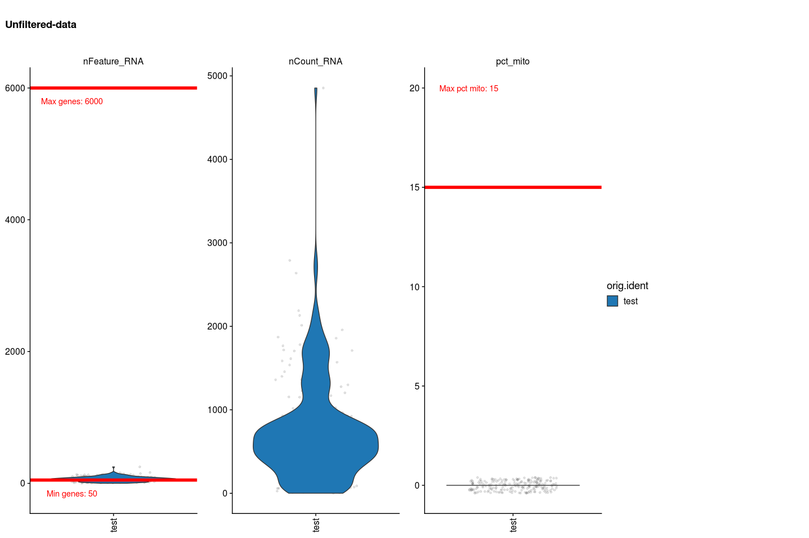
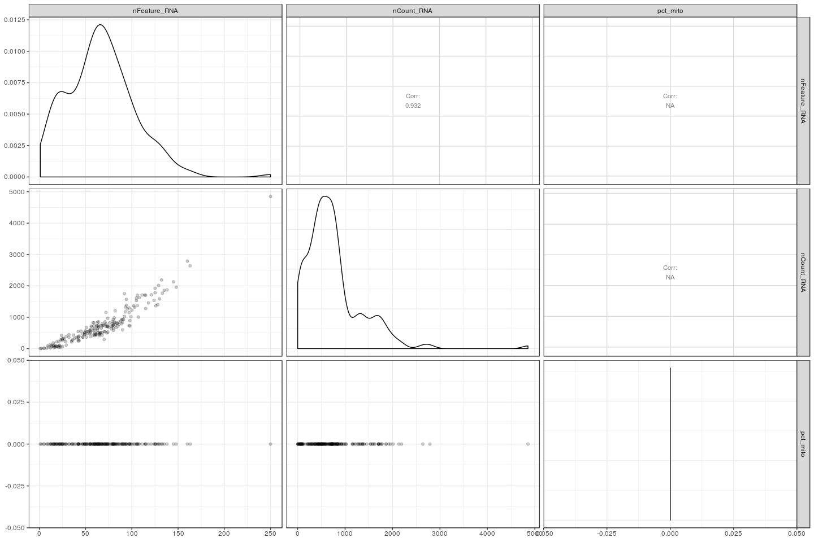
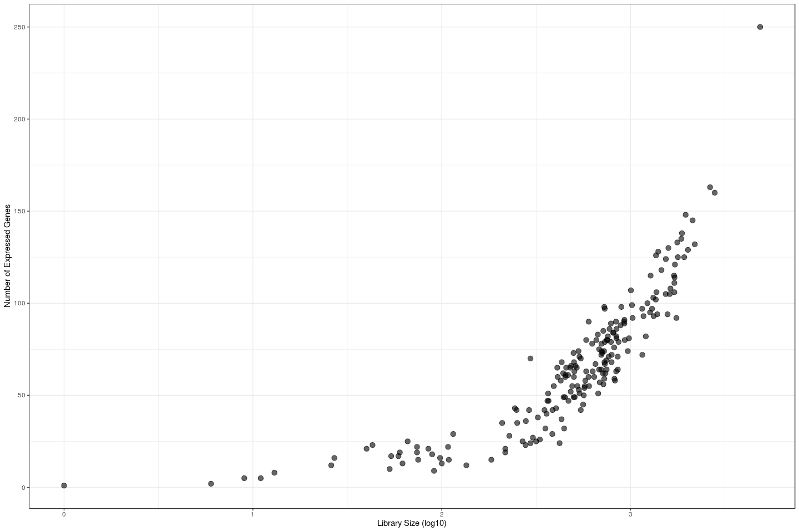
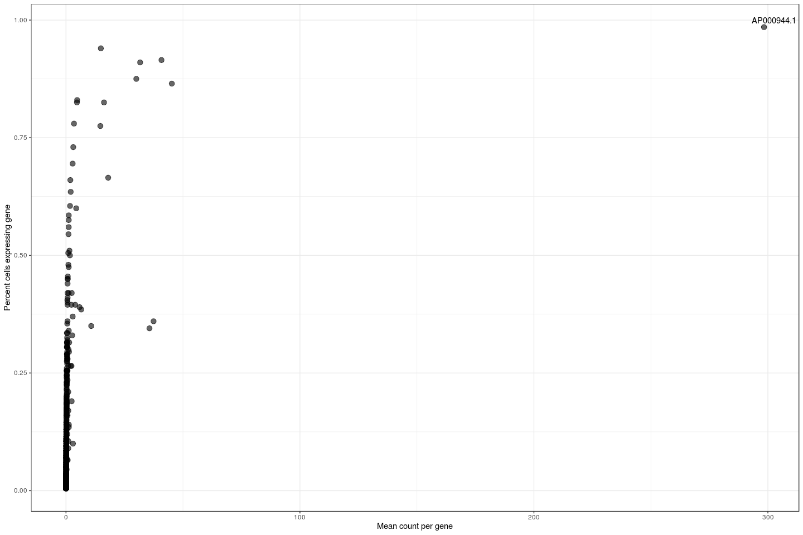
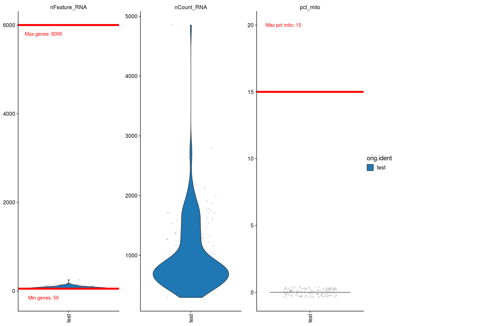
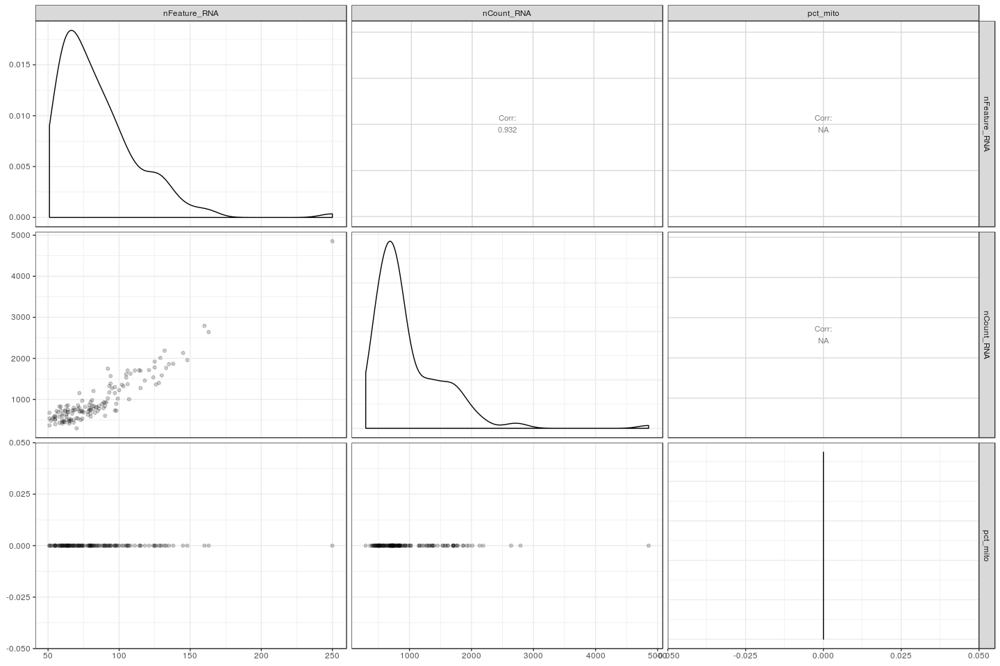
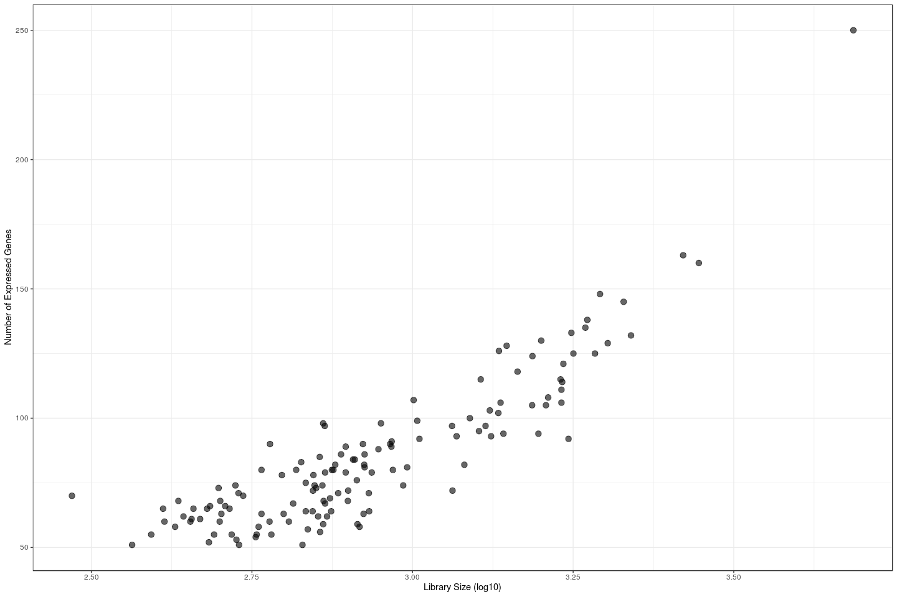
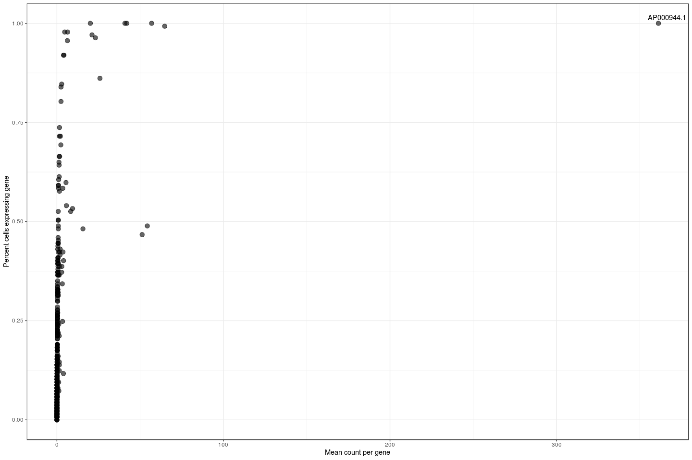

# Preprocessing single cell RNA sequencing data

This markdown file contains the code to download and preprocess single cell RNA sequencing data, mostly using Seurat. To complement the code and my comments, I have compiled material from other single cell RNA sequencing resources.


# Create RMD

The output of this file is a directory called Create-test within which there will be a params.yml that saves the parameters from this file, and a log file. 

If you choose to use the cache = TRUE parameter, rendering this file may be quicker the second time around, but please be aware that when you run the file a second time, the cached code chunk will not run again unless you change something *within* the code chunk. So, if you make changes *upstream* of the cached code chunk, the cached code chunk will not take that into account and output the cached result. 

# Read in 10x data


Curently, features, i.e genes, hashtags, and CITE-Seq antibodies, are labelled as "Gene Expression" or "Antibody Capture". We collect all of the data corresponding to Gene Expression and put it in one matrix, and all of the data corresponding to Antibody Capture, and put it in another matrix. We then store these two matrices in the list `counts_mat`. 

We select the "Gene Expression" matrix from  our list `counts_mat` and use it to create a Seurat object. Seurat objects are data containers with a specific structure. @@@ DRAW HERE@@ 


Some experiments use hashtags to multiplex the data. The following code will be run if `hashtag_ID`s were specified in the parameter section. ADT data will also be processed if `ADT` is set to TRUE. 


The seurat object (no filtering) was saved as ./Create-test//seurat_obj_raw.rds

# Demultiplex data 

If there are hashtags, we demultiplex the cells, and plot the hashtag data. We also remove cells that are labeled "Singlets" or "Doublets"


If there are hashtags, and `hashtags_t_keep` was set, we only use these selected hashtags downstream: 


Here we have the opportunity to rename our hashtags to cleaner sample names using the list `sample_names` set above.


# Quality control

We use the number of unique molecular counts (UMIs), number of expressed genes, and the percent of counts that are from mitochondrial RNA to filter low quality cells. A cell with few UMIs and number of expressed genes but high percent of mitochondrial counts indicates that the  cell might be sheared, causing the cytoplasm to leak out of the cell leaving only the protected mRNA in the mitochondria. On the other hand, cells with high number of UMIs and high number of genes expressed may indicate a doublet [@Luecken2019].

To vizualize the quality of the cells, we plot violin plots of the number of genes, number of UMIs, and percent mitochondrial reads per cell. 

<!-- -->


The violin plots are great for getting an idea about what is going on for each of these variables on their own. Now we take a look at the relationship between these variables. 

We plot the number of UMIs, the number of genes, adn the percent mitochondria against each other. This is one way we can start to see if higher mitochondrial percentage is biological or technical. 

<!-- -->

We also plot the number of expressed genes per cell in relation to the the total number of aggregated counts per cell. This plot sheds light on the spread of the counts per cell. Are there few genes that have many counts? Are there many genes that have few counts?

<!-- -->

We are also curious about the quality of each gene. By plotting the percent of cells that express a certain gene against the mean of that gene we can see whether a gene is expressed in many cells or in few cells. 

<!-- -->

# Filtering

We filter the data using the hard cutoffs set in the parameters for minimum and maximum number of genes a cell may express, as well as the maximum mitochondrial percentage a cell can express. 
If the thresholds are not provided, cells with the most number of genes expressed (98%) and the least number of genes expressed (2%), and cells with greater that 10% mitochondrial counts will be removed.


<!-- -->


<!-- -->

<!-- -->

<!-- -->


If there are CITE-Seq antibodies, we also plot the percent of cells that express a certain ADT against the mean of that ADT we can see whether a ADT is expressed in many cells or in few cells. 


# Normalizing the data

We normalize the data using log_norm. The point of normalizing the data is to make the data less skewed.


# Dimensionality Reduction

We run PCA using the most variable genes. 


We run UMAP using the PCs calculated by PCA and parameters specified in the parameter section.


We save metadata as a csv to ./Create-test//metadata_create_test.csv


We plot dimensionality reductions that we calculated.
<!-- --><!-- --><!-- --><!-- --><!-- --><!-- --><!-- --><!-- --><!-- --><!-- --><!-- --><!-- --><!-- --><!-- --><!-- --><!-- --><!-- --><!-- --><!-- --><!-- -->


```
##  [1] FALSE FALSE FALSE FALSE FALSE FALSE FALSE FALSE FALSE FALSE FALSE FALSE
## [13] FALSE FALSE FALSE FALSE FALSE FALSE FALSE FALSE FALSE FALSE FALSE FALSE
## [25] FALSE FALSE FALSE FALSE FALSE FALSE FALSE FALSE FALSE FALSE FALSE FALSE
## [37] FALSE FALSE FALSE FALSE
```

Save rds to ./Create-test//seurat_obj.rds


# References

---
references:
- id: Luecken2019
  title: Current best practices in single‐cell RNA‐seq analysis: a tutorial
  author:
  - family: Luecken
    given: Malte
  container-title: Mol Sys Biol
  volume: 15
  URL: 'https://doi.org/10.15252/msb.20188746'
  DOI: 10.1038/nmat3283
  issue: 6
  publisher: EMBO Press
  type: article-journal
  issued:
    year: 2019
    month: 06
---
